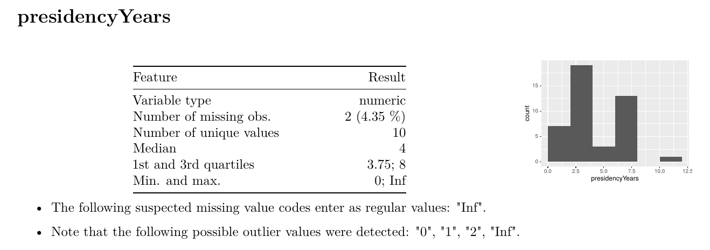
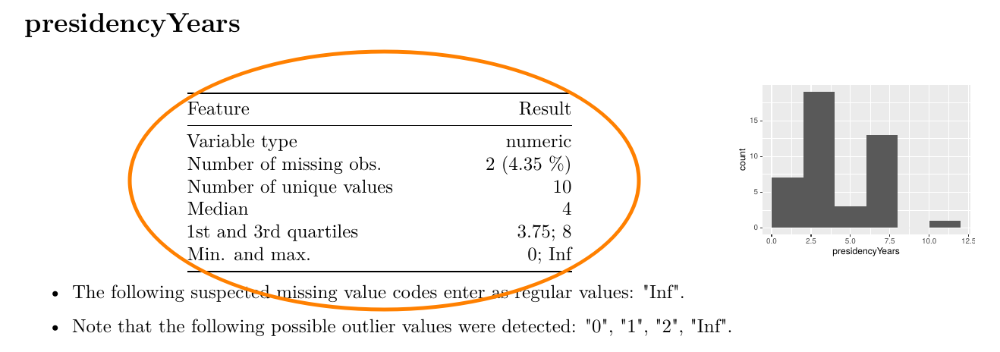
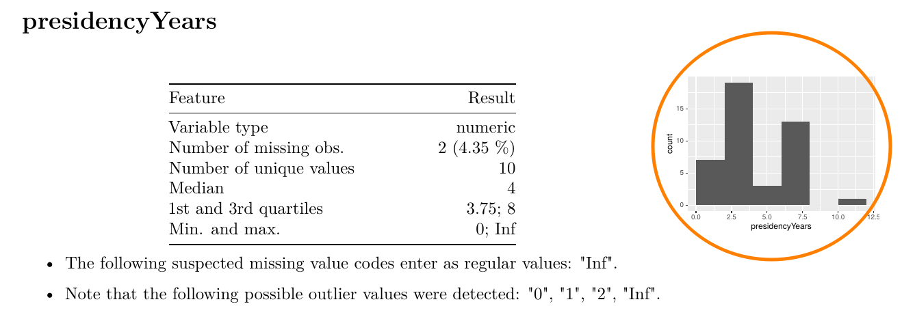
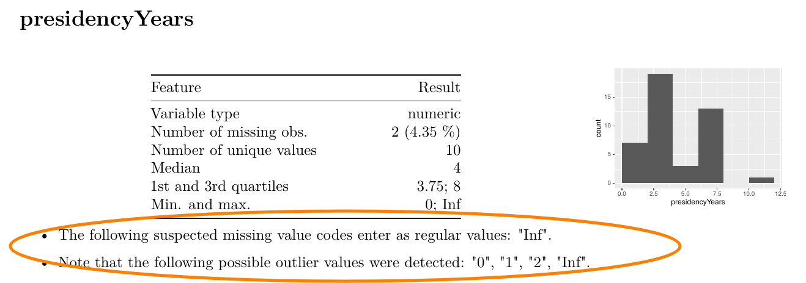
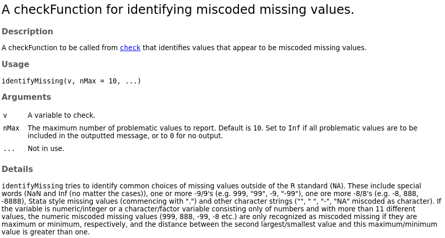
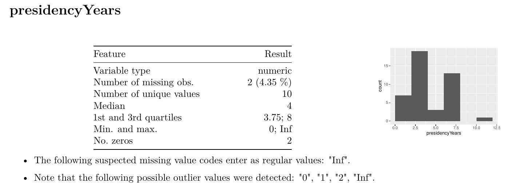

class: animated, fadeIn
layout: true

---


background-image: url(pics/title.png)
background-size: 100%


---


background-image: url(pics/manbeer.jpg)
background-size: 100%
class: middle, center

# The RESCueH project

```{r setup, include=TRUE, echo=FALSE, warning=FALSE, message=FALSE}
#library(knitr)
options(htmltools.dir.version = FALSE, cache=TRUE)
knitr::opts_chunk$set(dev.args=list(bg="transparent"), fig.width=16, fig.height=7)
source("kutheme.R")
```


---

class: center

# Timeline follow back

```{r, echo=FALSE}
DF <- data.frame(day1=sample(1:25, 6),
                 day2=c(NA, NA, sample(1:25, 3), 88),
                 day3=c(NA, 99, 40, sample(1:25, 3)))
head(DF, 4)
```

---

class: center

# Timeline follow back

```{r, echo=FALSE}
head(DF, 6)
```

---

class: center

# Monthly Alcohol units


```{r echo=FALSE,message=FALSE, warning=FALSE, error=FALSE}

tlfb <- data.frame(units=dget("tlfb.txt"))

p <- ggplot(tlfb, aes(units)) + geom_dotplot() +
     xlab("Units") + ylab("Frequency") + 
     theme_xkcd()+
    theme(
        axis.text.y = element_blank(),
      axis.ticks = element_blank()) 
p
```


---


background-image: url(pics/flower.png)
background-size: 60%
class: center, middle


---

# Design idea for dataReporter


*   Aid researchers in identifying problems that we didn't consider.
*   Ensure that everything you checked (and **didn't check**) is documented.
*   Enable **collaborations** with non-statisticians.
*   Encourage reproducible research


dataReporter is **not** 

*   a cleaner
*   a formal rule validator

Documentation to be **read** and **assessed** by a human.

---

.footnote[

# Data on US presidents


```{r eval=TRUE}
head(dataReporter::presidentData, 5)
```

]


---

# Let's see it in action

```{r eval=FALSE}
# Install package
devtools::install_github("ekstroem/dataReporter") 

# Load package
library(dataReporter)

# Get example data
data(presidentData)

# Main function
makeDataReport(presidentData) # Produces report

# When data is screened and "clear" for use
makeCodebook(presidentData) # Produces condensed codebook
```

---

background-image: url(pics/dr-1.png)
background-size: 80%

---

background-image: url(pics/dr-2.png)
background-size: 90%

---

background-image: url(pics/dr-3.png)
background-size: 85%

---

background-image: url(pics/dr-5.png)
background-size: 100%

---

background-image: url(pics/dr-4.png)
background-size: 100%

---

background-image: url(pics/dr-6.png)
background-size: 82%


.caption-right-vertical[makeCodebook() result]


---

background-image: url(pics/helper.png)
background-size: 100%

---

background-image: url(pics/flow.png)
background-size: 90%

---

# Pre-checking 

```{r, include = FALSE}
library(dataReporter)
```

- Check if a variable is eligible for being described/checked further in the report
- Don't want to describe/check:
    1. Keys (IDs)
    2. Singular variables (same value for all)
    3. Variable classes that are not supported by `dataReporter`
    4. ...
    
---

background-image: url(pics/dr-3.png)
background-size: 85%

---

background-image: url(pics/flow.png)
background-size: 90%

---

# Three steps of data quality assesment

1. **Summarize**: Simple summary statistics - what's in the variable?
2. **Visualize**: Look at the distribution of the variable - is the distribution as expected?
3. **Check**: Look for specific problems - is the variable valid?
--


What summaries/visualization/checks are relevant depends on the **class** of the variable.

---

# Looking at `presidencyYears`

```{r}
presidentData$presidencyYears
```
 
--

```{r}
class(presidentData$presidencyYears)
```

---

# Following the flow of `presidencyYears`

Note: Precheck passed - not key/singleton/unsupported

--

```{r, fig.align = "center", out.width = "100%", echo = FALSE}

```

---

# Following the flow of `presidencyYears`

Summarize

```{r, fig.align = "center", out.width = "100%", echo = FALSE}

```

---

# Following the flow of `presidencyYears`

Visualize

```{r, fig.align = "center", out.width = "100%", echo = FALSE}

```

---

# Following the flow of `presidencyYears`

Check

```{r, fig.align = "center", out.width = "100%", echo = FALSE}

```

<!-- --- -->

<!-- # Variable classes -->

<!-- `dataReporter` currently supports seven variable classes: -->

<!-- - **C** `character`  -->
<!-- - **F** `factor` -->
<!-- - **I** `integer`  -->
<!-- - **L** `labelled` (and `haven_labelled`) -->
<!-- - **B** `logical` (Boolean) -->
<!-- - **N** `numeric` -->
<!-- - **D** `Date` -->


<!-- The variables should be organized in a `data.frame`, `tibble` or `matrix`.  -->


---

# Built-in summary functions (1/2)
```{r, eval = FALSE}
allSummaryFunctions()
``` 
--
```{r, eval = FALSE}
-------------------------------------------------------------------------
name           description                     classes                   
-------------- ------------------------------- --------------------------
centralValue   Compute median for numeric      character, Date, factor,  
               variables, mode for             integer, labelled,        
               categorical variables           haven_labelled, logical,  
                                               numeric                   

countMissing   Compute proportion of missing   character, Date, factor,  
               observations                    integer, labelled,        
                                               haven_labelled, logical,  
                                               numeric                   

minMax         Find minimum and maximum        integer, numeric, Date    
               values                                                    

quartiles      Compute 1st and 3rd quartiles   Date, integer, numeric    

refCat         Find reference level            factor                    

uniqueValues   Count number of unique values   character, Date, factor,  
                                               integer, labelled,        
                                               haven_labelled, logical,  
                                               numeric                   

variableType   Data class of variable          character, Date, factor,  
                                               integer, labelled,        
                                               haven_labelled, logical,  
                                               numeric                   
-------------------------------------------------------------------------
```


---

# Built-in summary functions (2/2)

```{r, eval = FALSE}
-------------------------------------------------------------------------
name           description                     classes                   
-------------- ------------------------------- --------------------------
quartiles      Compute 1st and 3rd quartiles   Date, integer, numeric    

refCat         Find reference level            factor                    

uniqueValues   Count number of unique values   character, Date, factor,  
                                               integer, labelled,        
                                               haven_labelled, logical,  
                                               numeric                   

variableType   Data class of variable          character, Date, factor,  
                                               integer, labelled,        
                                               haven_labelled, logical,  
                                               numeric                   
-------------------------------------------------------------------------
```

---

# Built-in visual functions

```{r, eval = FALSE}
allVisualFunctions()

-------------------------------------------------------------------------------
name             description                     classes                       
---------------- ------------------------------- ------------------------------
basicVisual      Histograms and barplots using   character, Date, factor,      
                 graphics                        integer, labelled,            
                                                 haven_labelled, logical,      
                                                 numeric                       

standardVisual   Histograms and barplots using   character, Date, factor,      
                 ggplot2                         integer, labelled,            
                                                 haven_labelled, logical,      
                                                 numeric                       

tableVisual      Distribution tables             character, factor, labelled,  
                                                 haven_labelled                
-------------------------------------------------------------------------------
```


---

# Built-in check functions (1/3)

```{r, eval =FALSE}
allCheckFunctions()
----------------------------------------------------------
name                      description                     
------------------------- --------------------------------
identifyCaseIssues        Identify case issues            

identifyLoners            Identify levels with < 6 obs.   

identifyMissing           Identify miscoded missing       
                          values                          

identifyNums              Identify misclassified numeric  
                          or integer variables
```

---

# Built-in check functions (2/3)

```{r, eval =FALSE}
----------------------------------------------------------
name                      description                     
------------------------- --------------------------------
identifyOutliers          Identify outliers               

identifyOutliersTBStyle   Identify outliers (Tukey's      
                          Boxplot style)                  

identifyWhitespace        Identify prefixed and suffixed  
                          whitespace                      
``` 

---

# Built-in check functions (3/3)

```{r, eval =FALSE}
----------------------------------------------------------
name                      description                     
------------------------- --------------------------------
isCPR                     Identify Danish CPR numbers     

isKey                     Check if the variable is a key  

isSingular                Check if the variable contains  
                          only a single value             

isSupported               Check if the variable class is  
                          supported by dataReporter.      
----------------------------------------------------------
``` 

---

# Having a look at the documentation

```{r, eval = FALSE}
?identifyMissing
``` 

```{r, echo = FALSE, fig.align = "center", out.width = "80%"}

```

---

# Let's try an example: Report tweaking

- Output an html document instead of pdf
- Skip summaries altogether 
- Use the `tableVisual` function for `character` variables
- Only print up to 5 problematic values from checks 
- Treat `Name` variables as if the were `character` variables
- Name the report "Dirty presidents"
- ... 

---

# Using dataReporter interactively 

The summarize/visual/check steps can be run interactively too: 

```{r, eval = FALSE}
> check(presidentData$stateOfBirth)

$identifyMissing
No problems found.
$identifyWhitespace
No problems found.
$identifyLoners
Note that the following levels have at most five observations: 
  Arkansas, California, Connecticut, Georgia, Gondor, ..., 
  North Carolina, Pennsylvania, Tennessee, Texas, Vermont 
  (11 values omitted).
$identifyCaseIssues
Note that there might be case problems with the following 
  levels: New york, New York.
$identifyNums
No problems found.
```

---

# More interactive use
All individual summary/visual/check functions can be used interactively as well:
```{r, eval = FALSE}
> identifyCaseIssues(presidentData$stateOfBirth)

Note that there might be case problems with the following 
levels: New york, New York.
```
--
```{r}
str(identifyCaseIssues(presidentData$stateOfBirth))
```

---

# Adding custom functions 

New summary function that counts zeros:

```{r}
countZeros <- function(v, ...) {
  val <- sum(na.omit(v) == 0)
  summaryResult(list(feature = "No. zeros", 
                     result = val, 
                     value = val))
}
```
--
```{r}
countZeros <- summaryFunction(countZeros,
  description = "Count number of zeros",
  classes = c("character", "factor", "integer",
              "labelled", "numeric"))
```

---

# Custom function is now added to overview

```{r, eval = FALSE, results = "asis"}
> allSummaryFunctions()

----------------------------------------------------------------------------
name           description                     classes                      
-------------- ------------------------------- -----------------------------
countZeros     Count number of zeros           character, factor, integer,  
                                               labelled, numeric            

centralValue   Compute median for numeric      character, Date, factor,     
               variables, mode for             integer, labelled,           
               categorical variables           haven_labelled, logical,     
                                               numeric                      

countMissing   Compute proportion of missing   character, Date, factor,     
               observations                    integer, labelled,           
                                               haven_labelled, logical,     
                                               numeric                      
```

---

# Use custom functions interactively

```{r}
countZeros(presidentData$presidencyYears)
```
---

# Use custom functions in a report

```{r, eval = FALSE}
makeDataReport(presidentData, 
  summaries = setSummaries(
    numeric = defaultNumericSummaries(add = "countZeros")))
```
--
```{r, echo = FALSE, fig.align = "center", out.width = "90%"}

```

---

# Further resources for dataReporter

- **Article** in Journal of Statistical Software describing report making and interactive use: https://www.jstatsoft.org/article/view/v090i06 
- Detailed **vignette** about extending `dataReporter` with custom functions: `vignette("extending_dataReporter")`
- 3-4 hour **workshop** available: Ask for materials if you want to teach about `dataReporter` yourself - or invite us come and do it! &#9786;

---

# Don't be a stranger

Get in touch at https://github.com/ekstroem/dataReporter if you

- have a bug to report
- have a suggestion for new features
- have written a cool summary/visual/check function

or contact us at ahpe [at] sund.ku.dk (Anne) and ekstrom [at] sund.ku.dk (Claus)
